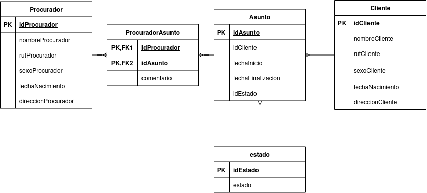

# Caso de Estudio
Se quiere diseñar una base de datos relacional para almacenar información sobre los asuntos que lleva un gabinete
de abogados. Cada asunto tiene un número de expediente que lo identifica, y corresponde a un solo cliente. Del
asunto se debe almacenar el período (fecha de inicio y fecha de archivo o finalización), su estado (en trámite,
archivado, etc), así como los datos personales del cliente al que pertenece (rut, nombre, direcciÓn, etc.). Algunos
asuntos son llevados por uno o varios procuradores, de los que nos interesa también los datos personales.

El modelo a usar en este caso es:

Imaginarse por favor las FK.

# Problemas solicitados

- Crear un procedimiento que vacíe completamente todas las tablas.

- Crear un procedimiento que además reinicie los id con Auto Increment.

- Crear un procedimiento que entregue información del id del cliente que se ingrese como parámetro.

- Crear un procedimiento que devuelva nombres e id bajo un nombre dado por parámetro.

- Crear un procedimiento que borre los datos de un cliente, considerar que no tiene on cascade ni nada.

- Crear 3 usuarios distintos con permisos distintos a la base de datos.

- Crear una nueva tabla historial y triggers que al hacer un registro, modificación o eliminación guarde un registro en el historial con el usuario que lo hizo.