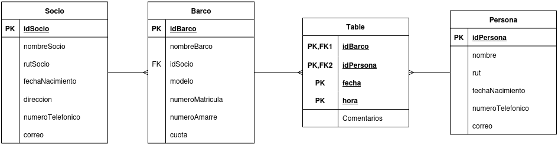

# Caso de Estudio
Un club náutico ha crecido enormemente en los últimos años, por lo que necesitan un sistema que permita registrar
los datos de sus socios, De cada socio se guardan sus datos personales así como los de su barco (o barcos). Se
requiere conocer del barco el número de matrícula, nombre, número del amarre y cuota que paga por el mismo.
Además se quiere mantener información de las salidas realizadas por cada barco, incluyendo la fecha, hora de
salida, el destino y los datos personales del patrón, el que no necesariamente tiene que ser propietario del barco o
socio del club.

# Problemas solicitados

- Crear un procedimiento que elimine todos los registros de las tablas de la base de datos sin afectar la estructura.

- Crear un procedimiento que vacíe todas las tablas y además reinicie los contadores de auto incremento para todas las claves primarias.

- Crear un procedimiento que reciba un `idSocio` como parámetro y devuelva toda la información relacionada con ese socio, como su nombre, rut, dirección, número telefónico y correo.

- Crear un procedimiento que reciba el `idBarco` como parámetro y devuelva los `idPersona` y los nombres de las personas asociadas a ese barco, consultando la tabla de relación entre Barcos y Personas.

- Crear un procedimiento que elimine todos los datos de un socio específico, asegurándose de eliminar también las asociaciones relacionadas (como las filas en la tabla de relación entre Barcos y Personas), sin depender de la opción `ON DELETE CASCADE`.
- Crear tres usuarios con diferentes niveles de acceso:

    - Usuario 1: Permisos de solo lectura (solo puede consultar información).

    - Usuario 2: Permisos de escritura (puede insertar, actualizar y eliminar datos).

    - Usuario 3: Permisos administrativos (puede gestionar la estructura de la base de datos, como crear tablas o modificar esquemas).
- Crear una nueva tabla llamada Historial que almacene información sobre las operaciones realizadas en las tablas principales (Socios, Barcos, Personas), incluyendo las inserciones, actualizaciones o eliminaciones, así como el usuario que realizó la operación.

- Crear triggers que registren en esta tabla cada vez que se realice una operación sobre las tablas, incluyendo el tipo de operación (`INSERT`, `UPDATE`, `DELETE`), la fecha y hora, el usuario que ejecutó la operación, y los detalles del cambio realizado.
